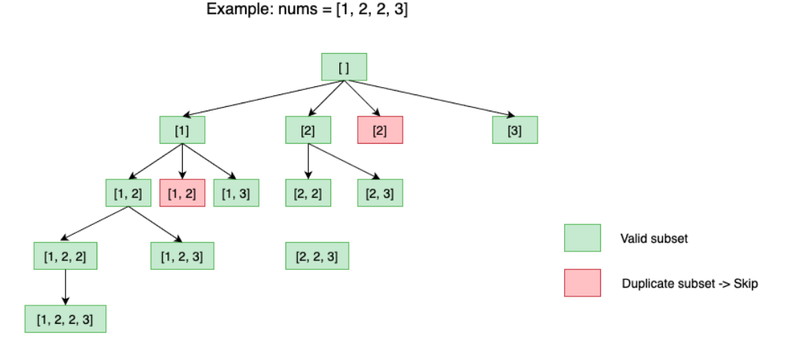

1. [Subset 2](https://leetcode.com/problems/subsets-ii/submissions/)

- Since the nums array may contain duplicate numbers, so in the 2^n subsets, it may contain duplicate subsets.
- We need to sort nums array to ensure all the generated subsets will also be sorted. This helps to identify duplicates. For example: subsets {3, 1, 3}, {1, 3, 3}, {3, 3, 1} will become {1, 3, 3}.
- If numbers are duplicates, we keep the first time, otherwise we skips. We can see it clearly through following picture.
- 

2. [Combination sum](https://leetcode.com/problems/combination-sum/)

3. [Palindrome partitioning](https://leetcode.com/problems/palindrome-partitioning/submissions/)

   - loop through the string and check if the substring is a palindrome or not.
   - if yes then push it into the secondary vector and call the function again with i+1 index.

4. [kth permutation](https://leetcode.com/problems/permutation-sequence/submissions/)

   - Locating in which group the next number of the ans string is present
   - using k/fact(rem-1)
